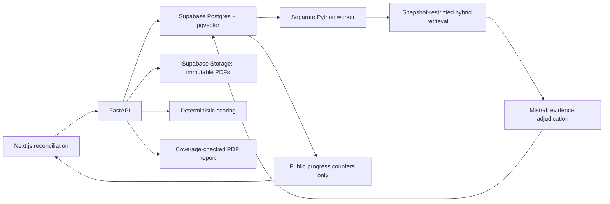

# Architecture

## Boundaries and ownership

The Next.js frontend presents reconciliation, original PDF citations, human decisions, scores and reports. Python/FastAPI owns all validation, ingestion, retrieval, immutable snapshot creation, deterministic scoring and report generation. A separate Python worker claims assessment jobs and writes incremental results. Supabase Postgres with pgvector persists application data, Supabase Storage retains exact PDF bytes, and Supabase Realtime publishes a minimal progress projection. Mistral supplies embeddings and evidence adjudication; it never calculates scores or decides report gap membership.

Frontend and backend have separate dependencies, build commands and configuration. [API contract](docs/api-contract.md) is their integration boundary. The orchestrator owns root documentation and integration checks; specialist agents own their folders. No user, login, organization, RBAC, OCR, Redis or Celery subsystem is introduced.

## Data model

Checklist hierarchy: domain → control → sub-control → criterion. Stable hierarchical criterion identifiers originate in the validated Excel importer or optional JSON loader. The Excel flow previews without persistence, then reparses the same SHA-256 source on confirmation with explicit human-selected evidence rules. It never evaluates formulas or follows external references. Checklists snapshot the template on creation, including scoring policy, provenance, weights, retrieval hints, applicability and the two independent evidence rules. Template editing cannot mutate a saved checklist.

Assessment creation freezes active, ready documents, copying content hash, immutable storage path and external version into run membership. For the demo, a run contains only the first checklist criterion; omitted criteria are not assessed. The run is explicitly scope-limited, its score stays provisional, and it cannot produce a final report export. Later uploads and removals affect only future assessments. Removal is soft while any snapshot references the original artifact. Each page stores normalized text spans; chunks reference spans. Evidence quotes and anchors are reconstructed from retained source spans rather than trusting model-generated coordinates.

AI results, per-document population results, citation review and human determinations are separate records. Citation changes invalidate dependent human decisions atomically. A monotonically increasing review revision pins report generation; export refuses stale review state and checks exact confirmed-gap coverage.

## Assessment and composition

The worker claims queued or expired jobs with a lease. Each criterion write is idempotent; a restart preserves completed results and snapshot membership. A controlled concurrency limit bounds model calls. Retries target failed results only.

Candidate document discovery and iterative lexical/semantic search use criterion text, sub-control context, key terms and expected evidence. Legal-reference columns are display-only and excluded from prompts used to retrieve. Queries never leave the data-room universe. Search saturates when no materially new retained evidence appears or the configured round limit is reached. Similar hits are adjudicated before becoming evidence.

One discovered document population is shared across each sub-control. `all_relevant_documents` requires every relevant document independently to satisfy the criterion. `same_document` requires clauses to coexist; for `any_relevant_document` a common satisfying document must exist across applicable clauses. Missing populations do not pass. Explicit contradictions take precedence over fulfillment; model/schema/service failures produce `analysis_failed`, never automatic No decisions. AI N/A requires a configured applicability condition.

## Human source of truth

All evidence must be accepted or rejected before finalization. Human Yes/No/N/A drives scores and confirmed gaps. A differing conclusion or unsupported Yes needs an override note, kept separate from data-room evidence. An AI gap with no evidence may be verified as No without fabricating evidence. Finalization of failed/pending analysis is blocked until technical analysis succeeds. The immutable AI conclusion remains visible.

Scoring is deterministic: Yes/(Yes+No), N/A and unreviewed cells excluded; weights come from the immutable checklist. Incomplete reviews display provisional scores. `criteria_engine_v1` preserves fixed sub-control weights and control sums, domain means filtered by each control's first sub-control status, and the overall mean of all ten domains. This unusual domain filter is disclosed at import. Legacy templates retain sum aggregation. Source formula validation and six actual-workbook scoring cases pass; native Excel recalculation remains unverified. See [the source mapping](docs/workbook-import.md).

Reports group human-confirmed No criteria by sub-control and carry deterministic gap IDs. Export requires exact mapped/expected gap equality and unchanged review revision. A final report also requires review completion. An incomplete draft requires explicit confirmation and a visible draft banner. LLM wording refinement is optional; deterministic report construction remains available.

## Service configuration and test isolation

The runtime requires Supabase Postgres/pgvector, private Storage and Mistral. There is no demo mode, automatic sample seed, local persistence fallback or deterministic assessment shortcut. Startup validates the required service configuration and rejects the obsolete `APP_MODE` variable. No secret values are included in configuration errors. Checklist templates are imported explicitly from the original workbook through the UI; the optional JSON loader remains an administrative path. Public project coordinates are in `config/project.toml`; `scripts/start_backend.py` loads the repository-root `.env` for API and worker only, with explicit process environment variables taking precedence. Loading happens at launcher invocation, never application import. The literal parser does not execute shell commands or expand variables; errors omit values. Missing keys stop startup rather than prompting. The file is Git-ignored and excluded from frontend configuration.

Secrets stay server-side. Browser configuration contains only optional public progress settings. Legal-document tables and the private storage bucket are unavailable to anonymous Supabase clients; the progress projection contains only status/counters/run IDs. The specification assumes the reviewer is already authorized, so deployment belongs behind an existing trusted access boundary; no new authentication model is added.

Each backend process uses a bounded SQLAlchemy pool: two connections by default, zero overflow, five-second checkout wait and ten-second connect timeout. One API plus one worker therefore permits at most four application connections at the default settings. `DB_POOL_SIZE` and `DB_POOL_TIMEOUT` can be configured in the root `.env`; budget every process and other database client against the project-wide limit. Failed/replaced pools and shutdown are disposed explicitly. Temporary connection exhaustion returns a sanitized 503 instead of an uncaught ASGI traceback. The session-pooler URL remains unchanged; switching to transaction mode requires separate prepared-statement/session-state compatibility work.

Automated tests inject isolated databases and fake provider adapters under `backend/tests/`. The separate-process integration harness is test code; it cannot be enabled by an application environment flag. Its results verify application invariants, not successful calls to live services.

`scripts/verify_integration.py` coordinates the isolated API/worker/UI acceptance flow with fresh fixtures and dynamic loopback ports. It strips live service settings, pins the UI build to the test API, retains per-run diagnostics and stops child process groups before removing temporary data. Harness health labels its provider synthetic and public runtime configuration is null. An explicitly partial TestClient transport is available for socket-restricted environments; it never records browser acceptance. The default browser checks measure rendered PDF pixels and normalized anchor bounds and exercise human review/export gates.

PDF uploads are the sole document input in the current scope. Google Drive and iManage are deferred, with no product controls or runtime import routes. Historical source metadata remains intact. The project-scoped Supabase MCP configuration is a development connection, separate from API/worker credentials; it has been parsed by Codex, while OAuth for that additional connection remains a user step.

## Current acceptance gates

See [PHASES.md](PHASES.md) for ordered checkpoints and [docs/specification.md](docs/specification.md) for the preserved source. The live Supabase schema, permissions, pgvector, private bucket and publication were verified through the connected plugin. Actual application access to Storage/Postgres, Mistral assessment and browser review still require their own verification evidence. Local tests do not establish these outcomes.

Implementation references: [Supabase Postgres Changes](https://supabase.com/docs/guides/realtime/postgres-changes), [Mistral chat completions](https://docs.mistral.ai/studio/conversations/chat-completion), [PyMuPDF text extraction](https://pymupdf.readthedocs.io/en/latest/app1.html).
